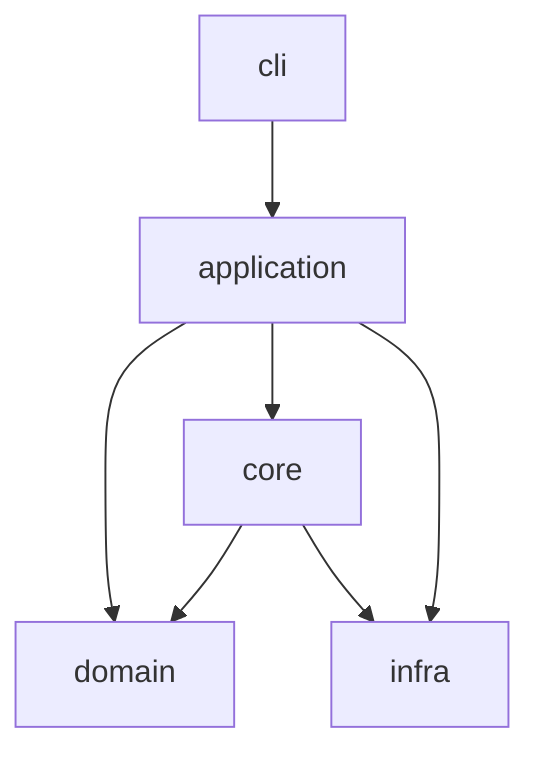

# OmniLAN Architecture

## Layered Design

## Modules

- `src/cli/`: 命令行接口与命令声明。
- `src/application/`: 运行编排、流程控制、命令执行入口。
- `src/domain/`: 核心数据模型与状态对象（配置、状态快照）。
- `src/core/engine/`: 双内核适配（mihomo / sing-box）。
- `src/core/gateway/`: 网关编排接口（IP 转发/NAT/DNS）。
- `src/core/enforcement/`: DHCP Assist、Policy Route、回滚脚本输出。
- `src/infra/platform/`: 操作系统网络能力实现（Linux/macOS/Windows）。
- `src/infra/service/`: 系统服务安装与卸载（systemd/launchd/task scheduler）。
- `src/infra/audit/`: 审计日志写入。

## Why This Structure

- 低耦合：业务流程和平台命令解耦。
- 可扩展：新增协议/平台能力不会污染入口层。
- 可测试：`domain/core` 可在不依赖系统命令的情况下测试。
- 可维护：平台特性集中在 `infra/platform`，定位问题更快。
